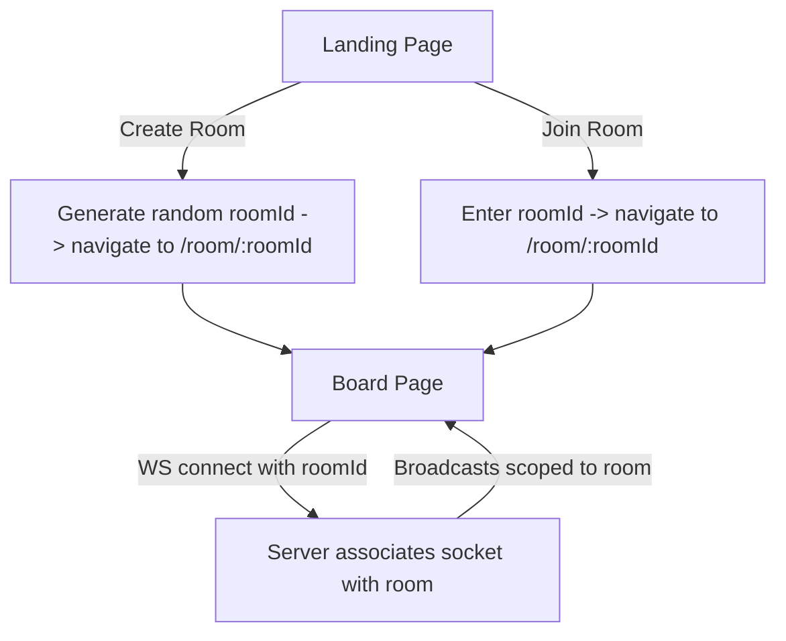

# RetroBoard

A real-time collaborative sprint retrospective board for remote teams. Create rooms, invite teammates, and collect feedback across three categories — all synced live via WebSockets.

## Features

- **Multi-Room Support** — Create or join rooms using a short room ID. Each room maintains its own isolated board.
- **Three-Column Board** — Organize feedback into *What Went Well*, *What to Improve*, and *Action Items*.
- **Real-Time Sync** — Cards are broadcast instantly to all connected users in the same room via WebSockets.
- **Card Management** — Add, inline-edit (click to edit), and delete cards. Changes propagate to all participants.
- **Save as PDF** — Export the current board state as a PDF using the browser's native print dialog.
- **Copy Room Link** — One-click copy of the shareable room URL from the board header.
- **Auto-Reconnect** — The WebSocket client automatically reconnects if the connection drops.
- **No Database** — All data is stored in-memory on the server. Lightweight and zero-config.
- **No Sign-Up** — No authentication required. Just create a room and share the ID.

## Tech Stack

| Layer | Technology | Version |
|---|---|---|
| Runtime | Node.js | >= 18.x |
| Server | Express | 4.x |
| WebSocket | ws | 8.x |
| Frontend | React | 19.x |
| Build Tool | Vite | 7.x |
| CSS | Tailwind CSS | 4.x |
| Routing | React Router | 7.x |
| ID Generation | uuid | 9.x |

## Architecture

### Multi-Room Flow



### Client-Server Overview

```
+--------------------------------------------------+
|                    Client                        |
|  React (Vite) + Tailwind CSS + React Router      |
|                                                  |
|  /               -> Lobby (Create / Join Room)   |
|  /room/:roomId   -> Board (3-column retro board) |
|                                                  |
|  useWebSocket hook connects to backend via WS    |
+-------------------------+------------------------+
                          |
                     WebSocket
                          |
+-------------------------v------------------------+
|                    Server                        |
|  Node.js + Express + ws                          |
|                                                  |
|  Static file serving (client/dist in production) |
|  WebSocket server (room-scoped broadcasts)       |
|  In-memory store: Map<roomId, Card[]>            |
+--------------------------------------------------+
```

### WebSocket Message Protocol

| Action | Client sends | Server broadcasts |
|---|---|---|
| Join room | `{ type: "join", roomId }` | `{ type: "init", cards }` |
| Add card | `{ type: "add", roomId, column, text }` | `{ type: "card-added", card }` |
| Edit card | `{ type: "edit", roomId, id, text }` | `{ type: "card-edited", id, text }` |
| Delete card | `{ type: "delete", roomId, id }` | `{ type: "card-deleted", id }` |

### Project Structure

```
RetroBoard/
├── server.js                       # Express + WebSocket backend
├── package.json                    # Backend dependencies
└── client/                         # React frontend
    ├── index.html                  # Entry HTML
    ├── vite.config.js              # Vite + Tailwind + WS proxy
    └── src/
        ├── main.jsx                # App entry with BrowserRouter
        ├── App.jsx                 # Route definitions
        ├── index.css               # Tailwind theme + print styles
        ├── pages/
        │   ├── Lobby.jsx           # Create / Join room
        │   └── Board.jsx           # 3-column retro board
        ├── components/
        │   ├── Column.jsx          # Single column with cards
        │   ├── Card.jsx            # Card with inline edit
        │   └── AddCardForm.jsx     # New card form
        └── hooks/
            └── useWebSocket.js     # WebSocket connection hook
```

## Getting Started

### Prerequisites

- [Node.js](https://nodejs.org/) v18 or higher
- npm (comes with Node.js)

### Clone and Install

```bash
git clone https://github.com/Nayan1729/RetroBoard.git
cd RetroBoard

# Install backend dependencies
npm install

# Install frontend dependencies
cd client
npm install
cd ..
```

### Run in Development

You need two terminals:

**Terminal 1 — Backend** (port 3001):
```bash
node server.js
```

**Terminal 2 — Frontend** (port 5173 with hot reload):
```bash
cd client
npm run dev
```

Open `http://localhost:5173` in your browser.

### Run in Production

```bash
# Build the React app
cd client
npm run build
cd ..

# Start the server (serves both API and static files)
node server.js
```

Open `http://localhost:3001` in your browser.

### Share with ngrok (optional)

To share your local instance over the internet:

```bash
# Build first
cd client && npm run build && cd ..

# Start the server
node server.js

# In another terminal, tunnel port 3001
ngrok http 3001
```

Share the generated ngrok URL with your team.

## Usage

1. Open the app and click **Create New Room** to start a new retrospective.
2. Share the room ID (shown in the header) or the full URL with your team.
3. Teammates open the link or enter the room ID on the lobby page.
4. Add cards to any of the three columns using the **+ Add Card** button.
5. Click on a card's text to edit it. Press **Enter** to save or **Escape** to cancel.
6. Hover over a card to reveal the **Delete** option.
7. Click **Save as PDF** to export the board. Select "Save as PDF" as the printer destination.

## Notes

- All data is stored in-memory and will be lost when the server restarts.
- Rooms are created on first connection and cleaned up when all cards are deleted.
- The free ngrok plan shows an interstitial page on first visit.
